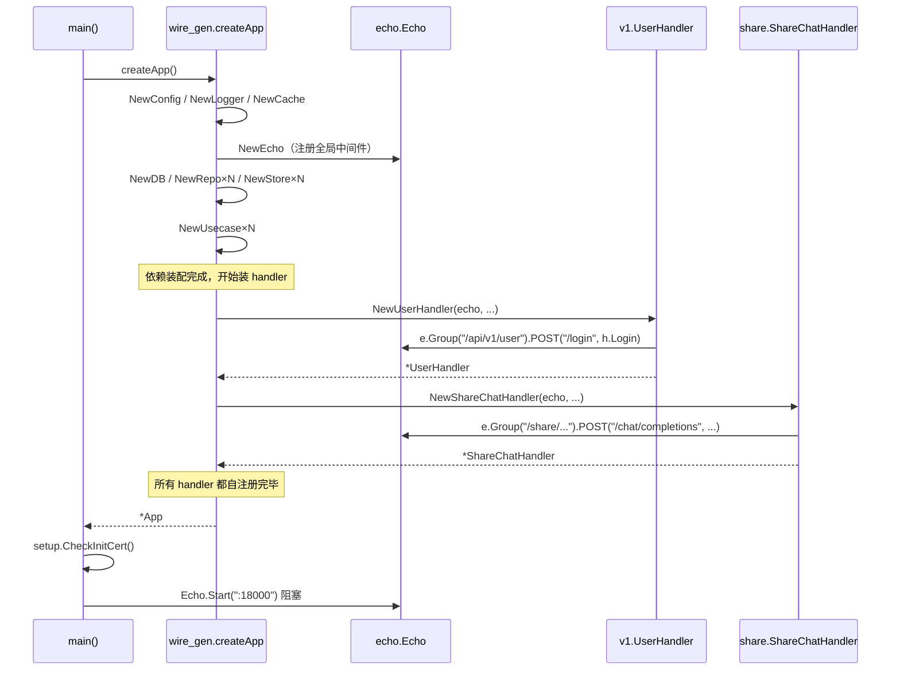

# API 进程启动链

> 从 `go run ./cmd/api` 到端口 18000 监听完成的全过程。

## main 函数：极简骨架

`backend/cmd/api/main.go`（28 行）：

```go
func main() {
    app, err := createApp()                          // (1) Wire 装配
    if err != nil { panic(err) }
    if err := setup.CheckInitCert(); err != nil {    // (2) 自签证书
        panic(err)
    }
    port := app.Config.HTTP.Port
    app.Logger.Info(fmt.Sprintf("Starting server on port %d", port))
    app.HTTPServer.Echo.Logger.Fatal(
        app.HTTPServer.Echo.Start(fmt.Sprintf(":%d", port)),
    )                                                // (3) 阻塞启动
}
```

3 个动作：装配 → 检查证书 → 启动监听。**所有业务初始化都被压缩到 `createApp()` 一行**。

## createApp：14 步装配（按 wire_gen.go 顺序）

`backend/cmd/api/wire_gen.go` 的 `createApp()` 函数本质是 `New*` 函数的拓扑排序。把它压成 14 个阶段：

| 阶段                         | 关键调用                                                         | 产出                                   |
| -------------------------- | ------------------------------------------------------------ | ------------------------------------ |
| 1. 配置                      | `config.NewConfig()`                                         | 读 `config.local.yml` + 环境变量          |
| 2. 日志                      | `log.NewLogger(cfg)`                                         | slog logger                          |
| 3. 中间件 (无依赖)               | `NewReadonlyMiddleware`、`NewSessionMiddleware`               | Readonly + Session                   |
| 4. Echo                    | `http.NewEcho(...)`                                          | 注册全局中间件、Sentry、APM、validator、swagger |
| 5. DB                      | `pg.NewDB(cfg)`                                              | GORM 实例                              |
| 6. Repo (cache/pg/mq/ipdb) | `pg2.NewUserRepository`...×N                                 | DAO 层                                |
| 7. AuthMiddleware          | `middleware.NewAuthMiddleware(...)`                          | 依赖 userAccessRepo + apiTokenRepo     |
| 8. Store                   | `rag.NewRAGService`、`s3.NewMinioClient`、`ipdb.NewIPDB`       | 外部服务客户端                              |
| 9. MQ Producer             | `mq.NewMQProducer(cfg)`                                      | NATS 发布客户端                           |
| 10. Usecase                | `usecase.NewKnowledgeBaseUsecase`...×N                       | 业务编排层                                |
| 11. ShareAuthMiddleware    | `middleware.NewShareAuthMiddleware(kbUsecase)`               | 依赖 kbUsecase（顺序敏感）                   |
| 12. BaseHandler            | `handler.NewBaseHandler(echo, ...)`                          | handler 共享基类                         |
| 13. Handler×N              | `v1.NewUserHandler(...)`、`share.NewShareChatHandler(...)`... | **构造时自注册路由**                         |
| 14. 聚合                     | `&v1.APIHandlers{...}`、`&share.ShareHandler{...}`            | 占位 struct，无人调用                       |

> 注：阶段 6-13 是反复混合的，不是严格分块；上面是逻辑分层。真正的执行顺序看 `wire_gen.go`。

## 第 13 步的关键："构造即注册"

每个 `NewXxxHandler` 都在构造时调用 `e.Group(...).GET/POST(...)`。例：

`backend/handler/v1/user.go:25-44`

```go
func NewUserHandler(e *echo.Echo, baseHandler *handler.BaseHandler, ...) *UserHandler {
    h := &UserHandler{...}
    group := e.Group("/api/v1/user")                            // ← 关键
    group.POST("/login", h.Login)
    group.GET("", h.GetUserInfo, h.auth.Authorize)
    group.GET("/list", h.ListUsers, h.auth.Authorize)
    // ... 其余路由
    return h
}
```

详见 [[Wire自注册模式]]。

## Echo 中间件链（NewEcho 内部）

`backend/server/http/http.go:40-128`：

```
echo.New()
├── HideBanner / HidePort
├── 自定义 Binder（路径参数 + query/body 分流）
├── 自定义 Validator（go-playground/validator）
├── ENV=local → Debug 模式 + /swagger/* 路由
├── 可选: Sentry middleware
├── 可选: OpenTelemetry middleware（apm.enabled）
├── RequestLogger middleware（slog 写每条请求）
├── ReadOnly middleware（pwMiddleware.ReadOnly）
└── Session middleware（sessionMiddleware.Session）
```

> ReadOnly 中间件在数据库被设为只读模式时拦截写请求；Session 处理 JWT/Cookie。Auth 中间件不在这里挂载，而是各 handler 自己挂到 group 上。

## 第 4 步「ENV=local → Swagger」要点

`http.go:67-70`：

```go
if os.Getenv("ENV") == "local" {
    e.Debug = true
    e.GET("/swagger/*", echoSwagger.WrapHandler)
}
```

dev 模式启动 API 时如果 `ENV=local` 没设，访问 `http://dev.localhost:18000/swagger/index.html` 就是 404。

## App struct 的字段命运

`wire.go:45-54`：

```go
type App struct {
    HTTPServer       *http.HTTPServer       // ← main 中用
    Handlers         *v1.APIHandlers        // ← 哑字段，副作用是注册了 admin 路由
    ProHandlers      *prov1.ProAPIHandlers  // ← 哑字段
    ShareHandlers    *share.ShareHandler    // ← 哑字段
    OpenAPIHandlers  *openapi.OpenAPIHandlers // ← 哑字段
    Config           *config.Config         // ← main 中用
    Logger           *log.Logger            // ← main 中用
    Telemetry        *telemetry.Client      // ← 哑字段
}
```

> 5 个 handler/telemetry 字段在 `main()` 里**完全没被读**。它们靠 Wire 实例化时执行的副作用（路由注册、telemetry 上报）生效。这是项目相对反常的设计，详见 [[Wire自注册模式]]。

## 端口 18000 的来源

`config.local.yml:54-55`：

```yaml
http:
  port: 18000
```

`main.go:25`: `port := app.Config.HTTP.Port` → `Echo.Start(":18000")`。

## 可视化：完整启动序列



## 易错点

- **不要 `go run cmd/api/main.go`**。这样会缺少 `wire_gen.go`，编译失败找不到 `createApp`。要 `go run ./cmd/api`。
- **新增 handler 必须在 ProviderSet 注册**。否则 Wire 不会调到 `New*Handler`，路由不会注册，访问就 404。详见 [[Wire自注册模式]] 的「常见坑」。
- **`go generate ./...` 会重新生成 wire_gen.go**。手改 wire_gen.go 没意义，下次 `make generate` 就被覆盖。
- **`scripts/wire-auto-register.sh` 自动检测新 Provider**。手动维护 ProviderSet 容易漏，项目自带这个脚本。

## 关联

- [[00-启动流程总览]]
- [[Wire自注册模式]]
- [[Consumer进程启动链]]
- [[Backend-API进程]]
- [[后端分层]]
