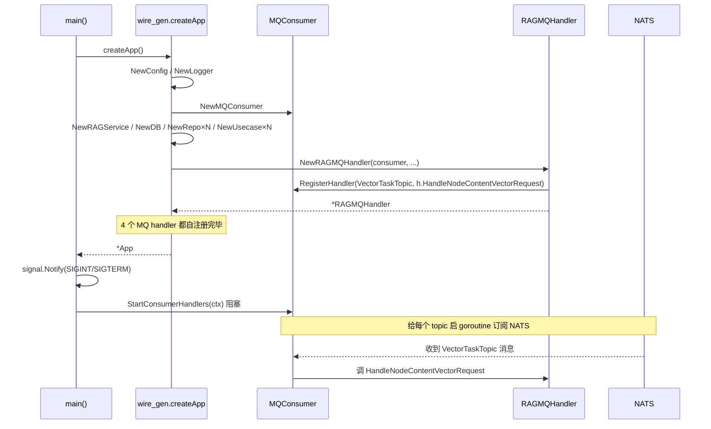

# Consumer 进程启动链

> 从 `go run ./cmd/consumer` 到阻塞监听 NATS 的全过程。

## main 函数：信号处理 + 阻塞消费

`backend/cmd/consumer/main.go`（42 行）：

```go
func main() {
    app, err := createApp()
    if err != nil { panic(err) }

    ctx, cancel := context.WithCancel(context.Background())
    defer cancel()

    sigChan := make(chan os.Signal, 1)
    signal.Notify(sigChan, syscall.SIGINT, syscall.SIGTERM)
    go func() {
        sig := <-sigChan
        log.Printf("received shutdown signal: %s\n", sig.String())
        cancel()                                       // 触发 ctx 取消
    }()

    if err := app.MQConsumer.StartConsumerHandlers(ctx); err != nil {
        log.Printf("consumer handlers error: %v\n", err)
    }

    log.Println("shutting down consumer gracefully...")
    if err := app.MQConsumer.Close(); err != nil {
        log.Printf("failed to close consumer: %v\n", err)
    }
    log.Println("consumer shutdown complete")
}
```

3 段：装配 → 监听 SIGINT/SIGTERM → `StartConsumerHandlers` 阻塞。比 API 多了优雅退出。

## createApp：8 步装配（按 wire_gen.go 顺序）

`backend/cmd/consumer/wire_gen.go`：比 API 简洁得多，不需要 echo/handler/middleware：

| 阶段 | 关键调用 | 产出 |
|---|---|---|
| 1. 配置 + 日志 | `config.NewConfig`、`log.NewLogger` | 同 API |
| 2. MQ Consumer | `mq.NewMQConsumer(cfg, logger)` | NATS 订阅客户端 |
| 3. Store | `rag.NewRAGService`、`s3.NewMinioClient`、`ipdb.NewIPDB`、`cache.NewCache` | 外部客户端 |
| 4. DB + Repo | `pg.NewDB`、`pg2.NewNodeRepository` 等 | 数据访问 |
| 5. Usecase | `usecase.NewLLMUsecase`、`NewModelUsecase`、`NewNodeUsecase`、`NewStatUseCase`、`NewSyncUsecase` | 业务逻辑 |
| 6. MQ Handler ×4 | `NewRAGMQHandler`、`NewRagDocUpdateHandler`、`NewStatCronHandler`、`NewSyncCronHandler` | **构造时自注册订阅** |
| 7. 聚合 | `&MQHandlers{...}` | 占位 struct |
| 8. App 组装 | `&App{MQConsumer, Config, MQHandlers, StatCronHandler}` | 返回给 main |

## 第 6 步的关键："构造即订阅"

`backend/handler/mq/rag.go:35-47`：

```go
func NewRAGMQHandler(consumer mq.MQConsumer, logger *log.Logger,
    rag rag.RAGService, nodeRepo *pg.NodeRepository,
    kbRepo *pg.KnowledgeBaseRepository) (*RAGMQHandler, error) {

    h := &RAGMQHandler{
        consumer: consumer, logger: logger.WithModule("mq.vector"),
        rag: rag, nodeRepo: nodeRepo, kbRepo: kbRepo,
    }
    if err := consumer.RegisterHandler(
        domain.VectorTaskTopic,                       // ← topic
        h.HandleNodeContentVectorRequest,             // ← callback
    ); err != nil {
        return nil, err
    }
    return h, nil
}
```

> **同 [[Wire自注册模式]]**：Wire 实例化 `*RAGMQHandler` 时，副作用就是把 `VectorTaskTopic` 的处理器注册到 `mqConsumer` 上。装配完成后，`mqConsumer` 内部已经有完整的 topic→handler 映射表。

## 4 个 MQ Handler 各管什么

| Handler               | Topic                    | 触发                     | 干什么                                |
| --------------------- | ------------------------ | ---------------------- | ---------------------------------- |
| `RAGMQHandler`        | `domain.VectorTaskTopic` | 文档创建/更新时 API 端 publish | 调 [[Raglite]] 学习文档（embedding 入向量库） |
| `RagDocUpdateHandler` | （文档更新事件）                 | 文档元数据变更                | 同步元数据到 raglite                     |
| `StatCronHandler`     | cron schedule            | 定时（不是 NATS 订阅）         | 聚合统计、刷热度榜                          |
| `SyncCronHandler`     | cron schedule            | 定时                     | 同步外部知识源（CUC 等）                     |

> Cron handlers 严格说不是 NATS 订阅，它们是 `StartConsumerHandlers` 启动后通过定时器触发。但都被 `MQConsumer.RegisterHandler` 统一管理，所以放在 mq 包下。

## StartConsumerHandlers 的契约

`backend/mq/mq.go:22-23`：

```go
StartConsumerHandlers(ctx context.Context) error
RegisterHandler(topic string, handler func(ctx context.Context, msg types.Message) error) error
```

调用关系：
1. `New*Handler`（构造期）→ 调 `RegisterHandler` 把回调存进内部 map
2. `main()` → 调 `StartConsumerHandlers(ctx)` → 遍历 map 给每个 topic 启 goroutine 阻塞订阅
3. 收到信号 → `cancel()` → ctx 取消 → 所有订阅 goroutine 退出 → `StartConsumerHandlers` 返回

## App struct 字段

`wire.go`:

```go
type App struct {
    MQConsumer      mq.MQConsumer       // ← main 中用
    Config          *config.Config      // ← 哑字段
    MQHandlers      *mq2.MQHandlers     // ← 哑字段（副作用：4 个订阅已注册）
    StatCronHandler *mq2.CronHandler    // ← 哑字段（被 MQHandlers 也持有）
}
```

跟 API 一样：handler 字段不被读，存在只是为了让 Wire 实例化它。

## 端口？没有

Consumer 不监听 HTTP 端口，所以 `lsof -i` 看不到它。它只持有 NATS 连接（向 `dev.localhost:13200` 订阅）和 PG 连接（向 `dev.localhost:13100`）。

## 易错点

- **API 写消息、Consumer 读消息**。生产端在 [[Backend-API进程]] 用 `MQProducer`；消费端这里用 `MQConsumer`。两个进程各自维护一份 NATS 连接。
- **Consumer 不参与同步问答路径**。AI 问答（[[AI问答请求路径]]）是 API 直接调 [[Raglite]]，*不过* Consumer。Consumer 只跑「学习文档」这种异步任务。
- **Consumer 挂了不影响在线问答**。但「新文档不再向量化」会让新文档搜不到。
- **新增订阅必须改 ProviderSet**。在 `backend/handler/mq/provider.go` 的 `ProviderSet` 加 `New*Handler`，并在 `MQHandlers` struct 加字段。

## 可视化



## 关联

- [[00-启动流程总览]]
- [[API进程启动链]]
- [[Wire自注册模式]]
- [[Backend-Consumer进程]]
- [[NATS]]
- [[AI问答请求路径]]
